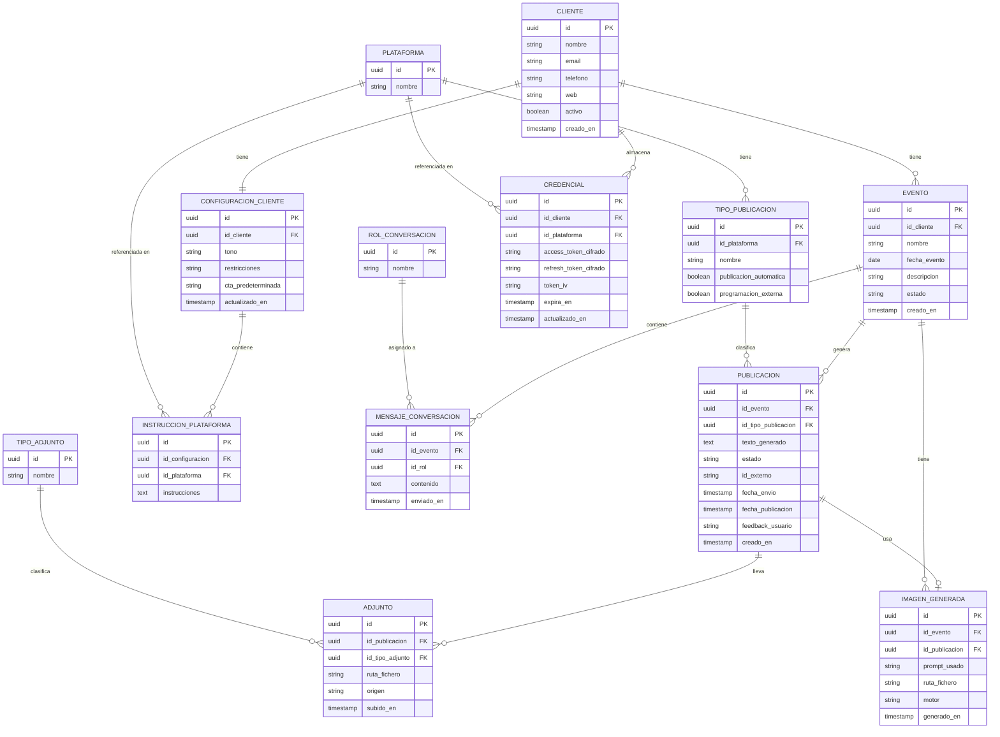

# Esquema Entidad-Relación — Community Manager
**Versión:** 4.0  
**Fecha:** Abril 2026  
**Estado:** Cerrado  

---

## Descripción general

Software local multi-cliente para gestión y publicación de contenido en redes sociales (Meta y YouTube). El usuario es el único operador. La IA (Claude) genera contenido de forma autónoma por detrás mediante Tool Use, y el usuario supervisa y aprueba todo antes de publicar.

---

## Diagrama E-R



---

## Descripción de entidades

### PLATAFORMA
Tabla auxiliar. Catálogo de redes sociales y canales de publicación soportados.

| Campo | Descripción |
|---|---|
| `id` | Identificador único UUID |
| `nombre` | Nombre de la plataforma |

**Valores iniciales:** Facebook, Instagram, YouTube, Blog Web

---

### TIPO_PUBLICACION
Tabla auxiliar. Catálogo de tipos de contenido publicable, ligados a una plataforma concreta. Controla el comportamiento de publicación sin necesidad de tocar código.

| Campo | Descripción |
|---|---|
| `id` | Identificador único UUID |
| `id_plataforma` | FK a PLATAFORMA |
| `nombre` | Nombre del tipo (ej: Post, Reel, Story, Vídeo) |
| `publicacion_automatica` | `true` si la app puede publicar vía API, `false` si requiere acción manual |
| `programacion_externa` | `true` si la plataforma soporta recibir una fecha futura en la llamada API |

**Comportamiento según combinación de flags:**

| publicacion_automatica | programacion_externa | Comportamiento |
|---|---|---|
| true | true | La app envía a la API con fecha futura — la plataforma gestiona el timing |
| true | false | La app envía a la API para publicación inmediata |
| false | false | Manual — el usuario publica a mano (ej: Blog Web) |

**Valores iniciales:**

| Plataforma | Tipo | publicacion_automatica | programacion_externa |
|---|---|---|---|
| Facebook | Post | true | true |
| Facebook | Evento | true | true |
| Facebook | Reel | true | false |
| Instagram | Post | true | true |
| Instagram | Story | true | false |
| YouTube | Vídeo | true | true |
| Blog Web | Post | false | false |

---

### ROL_CONVERSACION
Tabla auxiliar. Catálogo de roles posibles en la conversación de un evento.

| Campo | Descripción |
|---|---|
| `id` | Identificador único UUID |
| `nombre` | Nombre del rol |

**Valores iniciales:** Usuario, Claude

---

### TIPO_ADJUNTO
Tabla auxiliar. Catálogo de tipos de archivo adjunto soportados.

| Campo | Descripción |
|---|---|
| `id` | Identificador único UUID |
| `nombre` | Nombre del tipo |

**Valores iniciales:** Imagen, Vídeo

---

### CLIENTE
Entidad raíz. Representa una organización o marca gestionada desde la aplicación. El switch global de la UI cambia el cliente activo y afecta a todo el contexto.

| Campo | Descripción |
|---|---|
| `id` | Identificador único UUID |
| `nombre` | Nombre de la organización (ej: "ABS El Pisotón") |
| `email` | Email de contacto |
| `telefono` | Teléfono de contacto |
| `web` | URL del sitio web |
| `activo` | Indica si el cliente está operativo |
| `creado_en` | Fecha de alta en el sistema |

---

### CONFIGURACION_CLIENTE
Parámetros generales del system prompt de Claude para un cliente. Las instrucciones específicas por plataforma se almacenan en `INSTRUCCION_PLATAFORMA`.

| Campo | Descripción |
|---|---|
| `id` | Identificador único UUID |
| `id_cliente` | FK a CLIENTE |
| `tono` | Tono de comunicación (ej: "cercano y entusiasta") |
| `restricciones` | Temas o palabras a evitar |
| `cta_predeterminada` | Llamada a la acción por defecto |
| `actualizado_en` | Última modificación |

---

### INSTRUCCION_PLATAFORMA
Instrucciones específicas de Claude para una plataforma dentro de la configuración de un cliente. La combinación `(id_configuracion, id_plataforma)` debe ser única — restricción de unicidad compuesta en base de datos.

| Campo | Descripción |
|---|---|
| `id` | Identificador único UUID |
| `id_configuracion` | FK a CONFIGURACION_CLIENTE |
| `id_plataforma` | FK a PLATAFORMA |
| `instrucciones` | Texto libre con las instrucciones para esa plataforma |

---

### CREDENCIAL
Tokens de acceso a APIs externas cifrados con AES, por cliente y plataforma. El vector de inicialización (`token_iv`) es necesario para descifrar. La clave maestra vive en `.env` y nunca toca la base de datos.

| Campo | Descripción |
|---|---|
| `id` | Identificador único UUID |
| `id_cliente` | FK a CLIENTE |
| `id_plataforma` | FK a PLATAFORMA |
| `access_token_cifrado` | Token de acceso cifrado con AES |
| `refresh_token_cifrado` | Token de refresco cifrado con AES |
| `token_iv` | Vector de inicialización AES (no secreto, necesario para descifrar) |
| `expira_en` | Timestamp de expiración del token |
| `actualizado_en` | Última renovación |

---

### EVENTO
Contenedor principal de trabajo. Agrupa la conversación con Claude y todas las publicaciones generadas para un mismo evento o campaña. Cada evento tiene su propia conversación aislada.

| Campo | Descripción |
|---|---|
| `id` | Identificador único UUID |
| `id_cliente` | FK a CLIENTE |
| `nombre` | Nombre del evento (ej: "Milonga de verano") |
| `fecha_evento` | Fecha en que ocurre el evento real |
| `descripcion` | Descripción general |
| `estado` | `BORRADOR`, `ACTIVO`, `CERRADO` |
| `creado_en` | Fecha de creación en el sistema |

---

### MENSAJE_CONVERSACION
Cada turno de la conversación dentro de un evento. El historial completo se envía a la API de Anthropic en cada llamada — Claude no tiene memoria propia.

| Campo | Descripción |
|---|---|
| `id` | Identificador único UUID |
| `id_evento` | FK a EVENTO |
| `id_rol` | FK a ROL_CONVERSACION |
| `contenido` | Texto del mensaje |
| `enviado_en` | Timestamp del mensaje |

---

### PUBLICACION
Cada post, reel o vídeo generado por Claude para un evento. El tipo de publicación determina la plataforma destino y el comportamiento de envío.

| Campo | Descripción |
|---|---|
| `id` | Identificador único UUID |
| `id_evento` | FK a EVENTO |
| `id_tipo_publicacion` | FK a TIPO_PUBLICACION |
| `texto_generado` | Contenido textual generado por Claude |
| `estado` | `PENDIENTE`, `APROBADA`, `RECHAZADA`, `ENVIADA` |
| `id_externo` | ID devuelto por Meta o YouTube al enviar (para trazabilidad) |
| `fecha_envio` | Cuándo la app envió la publicación a la API de la plataforma |
| `fecha_publicacion` | Cuándo la plataforma publicará o publicó el contenido al público |
| `feedback_usuario` | Texto libre del usuario al pedir cambios a Claude |
| `creado_en` | Fecha de generación |

**Comportamiento de las fechas:**

| Escenario | fecha_envio | fecha_publicacion |
|---|---|---|
| Post normal (inmediato) | Momento del envío | Igual que fecha_envio |
| Post programado | Momento del envío a la API | Fecha futura elegida por el usuario |
| Post manual (Blog Web) | null | null o anotada manualmente |

**Ciclo de vida del estado:**
```
PENDIENTE → APROBADA → ENVIADA
         → RECHAZADA
```

---

### ADJUNTO
Archivo multimedia asociado a una publicación. Puede haber sido subido manualmente por el usuario o generado por Ideogram.

| Campo | Descripción |
|---|---|
| `id` | Identificador único UUID |
| `id_publicacion` | FK a PUBLICACION |
| `id_tipo_adjunto` | FK a TIPO_ADJUNTO |
| `ruta_fichero` | Ruta local al fichero |
| `origen` | `MANUAL` (subido por el usuario) o `GENERADO` (Ideogram) |
| `subido_en` | Timestamp de subida |

---

### IMAGEN_GENERADA
Imagen creada por Ideogram. Puede estar vinculada a un evento en general (cartel genérico) o a una publicación concreta.

| Campo | Descripción |
|---|---|
| `id` | Identificador único UUID |
| `id_evento` | FK a EVENTO (siempre presente) |
| `id_publicacion` | FK a PUBLICACION (opcional) |
| `prompt_usado` | Texto del prompt enviado a Ideogram |
| `ruta_fichero` | Ruta local al fichero generado |
| `motor` | Motor usado (ej: `ideogram-3`) |
| `generado_en` | Timestamp de generación |

---

## Relaciones

| Relación | Cardinalidad | Descripción |
|---|---|---|
| PLATAFORMA → TIPO_PUBLICACION | 1 a N | Una plataforma tiene varios tipos de publicación |
| PLATAFORMA → INSTRUCCION_PLATAFORMA | 1 a N | Una plataforma puede tener instrucciones en varias configuraciones |
| PLATAFORMA → CREDENCIAL | 1 a N | Una plataforma puede tener credenciales de varios clientes |
| TIPO_PUBLICACION → PUBLICACION | 1 a N | Un tipo clasifica varias publicaciones |
| ROL_CONVERSACION → MENSAJE_CONVERSACION | 1 a N | Un rol se asigna a varios mensajes |
| TIPO_ADJUNTO → ADJUNTO | 1 a N | Un tipo clasifica varios adjuntos |
| CLIENTE → CONFIGURACION_CLIENTE | 1 a 1 | Cada cliente tiene exactamente una configuración |
| CLIENTE → CREDENCIAL | 1 a N | Un cliente puede tener credenciales para varias plataformas |
| CLIENTE → EVENTO | 1 a N | Un cliente puede tener múltiples eventos |
| CONFIGURACION_CLIENTE → INSTRUCCION_PLATAFORMA | 1 a N | Una configuración tiene instrucciones por plataforma (combinación única) |
| EVENTO → MENSAJE_CONVERSACION | 1 a N | El historial de chat pertenece al evento |
| EVENTO → PUBLICACION | 1 a N | Un evento genera varias publicaciones |
| EVENTO → IMAGEN_GENERADA | 1 a N | Un evento puede tener imágenes generadas |
| PUBLICACION → ADJUNTO | 1 a N | Una publicación puede llevar varios adjuntos |
| PUBLICACION → IMAGEN_GENERADA | 1 a 0..1 | Una publicación puede usar una imagen generada |

---

## Datos iniciales (seed)

Al arrancar la aplicación por primera vez se insertan automáticamente:

**PLATAFORMA:** Facebook, Instagram, YouTube, Blog Web

**TIPO_PUBLICACION:**

| Plataforma | Tipo | publicacion_automatica | programacion_externa |
|---|---|---|---|
| Facebook | Post | true | true |
| Facebook | Evento | true | true |
| Facebook | Reel | true | false |
| Instagram | Post | true | true |
| Instagram | Story | true | false |
| YouTube | Vídeo | true | true |
| Blog Web | Post | false | false |

**ROL_CONVERSACION:** Usuario, Claude

**TIPO_ADJUNTO:** Imagen, Vídeo

---

## Decisiones técnicas registradas

- **Tablas auxiliares normalizadas** — `PLATAFORMA`, `TIPO_PUBLICACION`, `ROL_CONVERSACION` y `TIPO_ADJUNTO` permiten añadir nuevos valores sin tocar código.
- **INSTRUCCION_PLATAFORMA separada de CONFIGURACION_CLIENTE** — instrucciones editables por plataforma. La combinación `(id_configuracion, id_plataforma)` tiene restricción de unicidad compuesta.
- **CREDENCIAL cifrada con AES** — tokens cifrados en H2. El `token_iv` se guarda en base de datos; la clave maestra vive en `.env`.
- **PUBLICACION sin campo plataforma** — la plataforma se deduce a través de `id_tipo_publicacion → TIPO_PUBLICACION → PLATAFORMA`.
- **TIPO_PUBLICACION.programacion_externa** — delega la programación de publicaciones a la plataforma (Meta/YouTube). La app no tiene scheduler propio.
- **PUBLICACION.fecha_envio y fecha_publicacion** — dos fechas separadas. `fecha_envio` es cuando la app llama a la API. `fecha_publicacion` es cuando la plataforma publica al público. Coinciden en posts inmediatos, difieren en posts programados.
- **PUBLICACION.id_externo** — ID devuelto por Meta o YouTube al enviar, para trazabilidad.
- **PUBLICACION.estado simplificado** — ciclo: `PENDIENTE → APROBADA → ENVIADA` o `PENDIENTE → RECHAZADA`. Sin estado PROGRAMADA — la programación es responsabilidad de la plataforma externa.
- **Conversación como parte del Evento** — el historial queda ligado al contexto. Cada evento nuevo abre una conversación nueva.
- **ADJUNTO.origen** — distingue `MANUAL` de `GENERADO` (Ideogram).
- **IMAGEN_GENERADA con doble FK** — puede pertenecer al evento en general o a una publicación específica.
- **Sin scheduler en Spring Boot** — no hay publicación automática programada en la app. Meta y YouTube gestionan su propio timing cuando `programacion_externa=true`.
- **Sin gestión de usuarios** — software local de usuario único.

---

*Documento actualizado el 12 de abril de 2026. Actualizar con cada decisión técnica relevante.*
