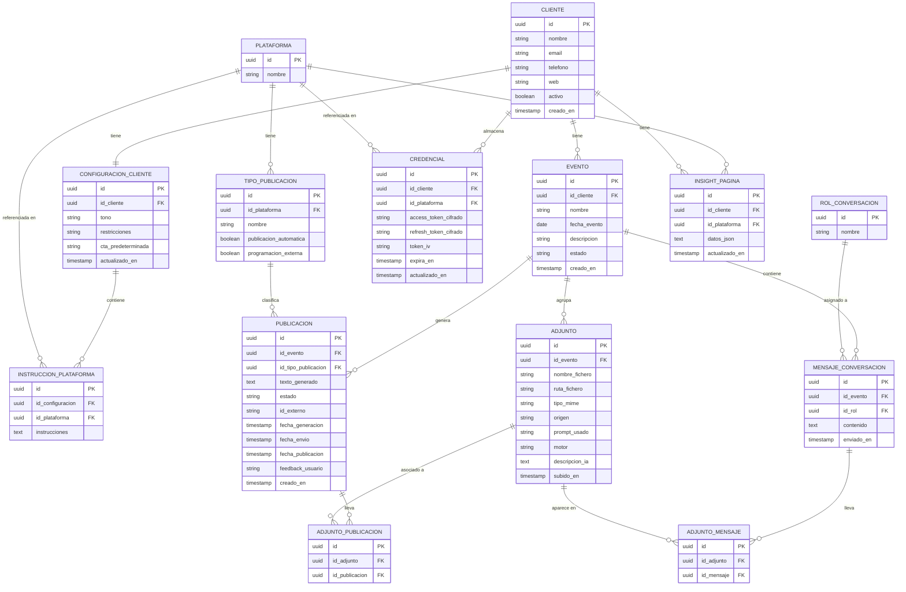

# Esquema Entidad-Relación — Community Manager
**Versión:** 5.6  
**Fecha:** Abril 2026  
**Estado:** Cerrado

---

## Descripción general

Software local multi-cliente para gestión y publicación de contenido en redes sociales (Meta y YouTube). El usuario es el único operador. La IA (Claude) genera contenido de forma autónoma por detrás mediante Tool Use, y el usuario supervisa y aprueba todo antes de publicar.

---

## Diagrama E-R



---

## Descripción de entidades

### PLATAFORMA
Tabla auxiliar. Catálogo de redes sociales y canales de publicación soportados.

| Campo | Descripción |
|---|---|
| `id` | Identificador único UUID |
| `nombre` | Nombre de la plataforma |

**Valores iniciales:** Facebook, Instagram, YouTube, Blog Web

---

### TIPO_PUBLICACION
Tabla auxiliar. Catálogo de tipos de contenido publicable, ligados a una plataforma concreta.

| Campo | Descripción |
|---|---|
| `id` | Identificador único UUID |
| `id_plataforma` | FK a PLATAFORMA |
| `nombre` | Nombre del tipo (ej: Post, Reel, Story, Vídeo) |
| `publicacion_automatica` | `true` si la app puede publicar vía API |
| `programacion_externa` | `true` si la plataforma soporta fecha futura en la llamada API |

**Comportamiento según combinación de flags:**

| publicacion_automatica | programacion_externa | Comportamiento |
|---|---|---|
| true | true | La app envía a la API con fecha futura |
| true | false | La app envía a la API para publicación inmediata |
| false | false | Manual — el usuario publica a mano |

**Valores iniciales:**

| Plataforma | Tipo | publicacion_automatica | programacion_externa |
|---|---|---|---|
| Facebook | Post | true | true |
| Facebook | Evento | true | true |
| Facebook | Reel | true | false |
| Instagram | Post | true | true |
| Instagram | Story | true | false |
| YouTube | Vídeo | true | true |
| Blog Web | Post | false | false |

---

### ROL_CONVERSACION
Tabla auxiliar. Catálogo de roles posibles en la conversación.

| Campo | Descripción |
|---|---|
| `id` | Identificador único UUID |
| `nombre` | Nombre del rol |

**Valores iniciales:** Usuario, Claude

---

### CLIENTE
Entidad raíz. Representa una organización o marca gestionada desde la aplicación.

| Campo | Descripción |
|---|---|
| `id` | Identificador único UUID |
| `nombre` | Nombre de la organización |
| `email` | Email de contacto |
| `telefono` | Teléfono de contacto |
| `web` | URL del sitio web |
| `activo` | Indica si el cliente está operativo |
| `creado_en` | Fecha de alta en el sistema |

---

### CONFIGURACION_CLIENTE
Parámetros generales del system prompt de Claude para un cliente.

| Campo | Descripción |
|---|---|
| `id` | Identificador único UUID |
| `id_cliente` | FK a CLIENTE |
| `tono` | Tono de comunicación |
| `restricciones` | Temas o palabras a evitar |
| `cta_predeterminada` | Llamada a la acción por defecto |
| `actualizado_en` | Última modificación |

---

### INSTRUCCION_PLATAFORMA
Instrucciones específicas de Claude por plataforma. La combinación `(id_configuracion, id_plataforma)` debe ser única.

| Campo | Descripción |
|---|---|
| `id` | Identificador único UUID |
| `id_configuracion` | FK a CONFIGURACION_CLIENTE |
| `id_plataforma` | FK a PLATAFORMA |
| `instrucciones` | Texto libre con instrucciones para esa plataforma |

---

### CREDENCIAL
Tokens de acceso a APIs externas cifrados con AES, por cliente y plataforma.

| Campo | Descripción |
|---|---|
| `id` | Identificador único UUID |
| `id_cliente` | FK a CLIENTE |
| `id_plataforma` | FK a PLATAFORMA |
| `access_token_cifrado` | Token de acceso cifrado con AES |
| `refresh_token_cifrado` | Token de refresco cifrado con AES |
| `token_iv` | Vector de inicialización AES |
| `expira_en` | Timestamp de expiración del token |
| `actualizado_en` | Última renovación |

---

### EVENTO
Contenedor principal de trabajo. Agrupa conversación, adjuntos y publicaciones.

| Campo | Descripción |
|---|---|
| `id` | Identificador único UUID |
| `id_cliente` | FK a CLIENTE |
| `nombre` | Nombre del evento |
| `fecha_evento` | Fecha en que ocurre el evento real |
| `descripcion` | Descripción general del evento |
| `estado` | `BORRADOR`, `ACTIVO`, `CERRADO` |
| `creado_en` | Fecha de creación en el sistema |

---

### MENSAJE_CONVERSACION
Cada turno de la conversación dentro de un evento.

| Campo | Descripción |
|---|---|
| `id` | Identificador único UUID |
| `id_evento` | FK a EVENTO |
| `id_rol` | FK a ROL_CONVERSACION |
| `contenido` | Texto del mensaje |
| `enviado_en` | Timestamp del mensaje |

---

### PUBLICACION
Cada post, reel o vídeo generado por Claude para un evento.

| Campo | Descripción |
|---|---|
| `id` | Identificador único UUID |
| `id_evento` | FK a EVENTO |
| `id_tipo_publicacion` | FK a TIPO_PUBLICACION |
| `texto_generado` | Contenido textual generado por Claude |
| `estado` | `PENDIENTE`, `APROBADA`, `RECHAZADA`, `ENVIADA` |
| `id_externo` | ID devuelto por Meta o YouTube al enviar |
| `fecha_generacion` | Cuándo Claude generó el contenido |
| `fecha_envio` | Cuándo la app envió a la API de la plataforma |
| `fecha_publicacion` | Cuándo la plataforma publicará al público |
| `feedback_usuario` | Texto libre del usuario al pedir cambios |
| `creado_en` | Fecha de creación del registro |

**Ciclo de vida:**
```
PENDIENTE → APROBADA → ENVIADA
         → RECHAZADA
```

---

### ADJUNTO
Entidad central para todos los ficheros del sistema. Sin FKs directas a publicación ni mensaje — las relaciones N-N se gestionan mediante `ADJUNTO_PUBLICACION` y `ADJUNTO_MENSAJE`.

| Campo | Descripción |
|---|---|
| `id` | Identificador único UUID |
| `id_evento` | FK a EVENTO — siempre presente, permite cargar todos los adjuntos del evento para Claude |
| `nombre_fichero` | Nombre original del fichero |
| `ruta_fichero` | Ruta local en storage |
| `tipo_mime` | Tipo MIME (`image/jpeg`, `application/pdf`, `video/mp4`, etc.) |
| `origen` | `MANUAL` (subido por el usuario) o `GENERADO` (Ideogram) |
| `prompt_usado` | Prompt enviado a Ideogram — solo si `origen=GENERADO` |
| `motor` | Motor de generación (ej: `ideogram-3`) — solo si `origen=GENERADO` |
| `descripcion_ia` | Descripción en texto generada por Claude al analizar el fichero. Si está rellena se usa en lugar del base64 en llamadas posteriores, evitando el error 429 por acumulación de tokens. |
| `subido_en` | Timestamp de subida o generación |

**Formatos soportados para subida manual:**
- Imágenes: `image/jpeg`, `image/png`, `image/gif`, `image/webp`
- Documentos: `application/pdf`
- Vídeo: `video/mp4`

**DOC/DOCX no soportados** por la API de Anthropic — deuda técnica aceptada.

**Cómo llegan a Claude:** En cada llamada se cargan todos los adjuntos del evento via `id_evento`. Si `descripcion_ia` está rellena se envía como texto; si es null se envía en base64 (solo la primera vez).

**Almacenamiento:**
```
storage/clientes/{id}_{nombre}/eventos/{id}_{nombre}/
├── adjuntos/    ← ficheros subidos manualmente
└── generados/  ← imágenes creadas por Ideogram
```

---

### ADJUNTO_PUBLICACION
Tabla de asociación N-N entre adjuntos y publicaciones. Un adjunto puede estar en varias publicaciones y una publicación puede tener varios adjuntos.

| Campo | Descripción |
|---|---|
| `id` | Identificador único UUID |
| `id_adjunto` | FK a ADJUNTO |
| `id_publicacion` | FK a PUBLICACION |
| `orden` | Integer — posición del adjunto en la publicación. 0 = imagen principal. Permite ordenar carruseles en Instagram y álbumes en Facebook. |

---

### ADJUNTO_MENSAJE
Tabla de asociación N-N entre adjuntos y mensajes. Un adjunto puede aparecer en varios mensajes y un mensaje puede tener varios adjuntos.

| Campo | Descripción |
|---|---|
| `id` | Identificador único UUID |
| `id_adjunto` | FK a ADJUNTO |
| `id_mensaje` | FK a MENSAJE_CONVERSACION |

---

### INSIGHT_PAGINA
Caché de insights de Meta por cliente y plataforma. Se refresca automáticamente si tiene más de 7 días.

| Campo | Descripción |
|---|---|
| `id` | Identificador único UUID |
| `id_cliente` | FK a CLIENTE |
| `id_plataforma` | FK a PLATAFORMA |
| `datos_json` | Payload completo devuelto por Meta Insights API, guardado tal cual |
| `actualizado_en` | Fecha de última actualización — si tiene más de 7 días se refresca |

**Uso:** Al construir el system prompt, si hay insights disponibles se incluye un resumen de los mejores momentos para publicar. Claude usa ese dato para sugerir fechas de programación óptimas.

---

## Relaciones

| Relación | Cardinalidad | Descripción |
|---|---|---|
| PLATAFORMA → TIPO_PUBLICACION | 1 a N | Una plataforma tiene varios tipos de publicación |
| PLATAFORMA → INSTRUCCION_PLATAFORMA | 1 a N | Una plataforma puede tener instrucciones en varias configuraciones |
| PLATAFORMA → CREDENCIAL | 1 a N | Una plataforma puede tener credenciales de varios clientes |
| TIPO_PUBLICACION → PUBLICACION | 1 a N | Un tipo clasifica varias publicaciones |
| ROL_CONVERSACION → MENSAJE_CONVERSACION | 1 a N | Un rol se asigna a varios mensajes |
| CLIENTE → CONFIGURACION_CLIENTE | 1 a 1 | Cada cliente tiene exactamente una configuración |
| CLIENTE → CREDENCIAL | 1 a N | Un cliente puede tener credenciales para varias plataformas |
| CLIENTE → EVENTO | 1 a N | Un cliente puede tener múltiples eventos |
| CONFIGURACION_CLIENTE → INSTRUCCION_PLATAFORMA | 1 a N | Una configuración tiene instrucciones por plataforma |
| EVENTO → MENSAJE_CONVERSACION | 1 a N | El historial de chat pertenece al evento |
| EVENTO → PUBLICACION | 1 a N | Un evento genera varias publicaciones |
| EVENTO → ADJUNTO | 1 a N | Un evento agrupa todos sus adjuntos |
| ADJUNTO ↔ PUBLICACION | N a N | Via ADJUNTO_PUBLICACION — un adjunto puede estar en varias publicaciones |
| ADJUNTO ↔ MENSAJE_CONVERSACION | N a N | Via ADJUNTO_MENSAJE — un adjunto puede aparecer en varios mensajes |
| CLIENTE → INSIGHT_PAGINA | 1 a N | Un cliente tiene insights por cada plataforma |
| PLATAFORMA → INSIGHT_PAGINA | 1 a N | Una plataforma puede tener insights de varios clientes |

---

## Datos iniciales (seed)

**PLATAFORMA:** Facebook, Instagram, YouTube, Blog Web

**TIPO_PUBLICACION:**

| Plataforma | Tipo | publicacion_automatica | programacion_externa |
|---|---|---|---|
| Facebook | Post | true | true |
| Facebook | Evento | true | true |
| Facebook | Reel | true | false |
| Instagram | Post | true | true |
| Instagram | Story | true | false |
| YouTube | Vídeo | true | true |
| Blog Web | Post | false | false |

**ROL_CONVERSACION:** Usuario, Claude

---

## Decisiones técnicas registradas

- **Tablas auxiliares normalizadas** — `PLATAFORMA`, `TIPO_PUBLICACION`, `ROL_CONVERSACION` permiten añadir valores sin tocar código.
- **INSTRUCCION_PLATAFORMA separada de CONFIGURACION_CLIENTE** — unicidad compuesta `(id_configuracion, id_plataforma)`.
- **CREDENCIAL cifrada con AES** — clave maestra en `.env`.
- **PUBLICACION sin campo plataforma** — se deduce via `id_tipo_publicacion → TIPO_PUBLICACION → PLATAFORMA`.
- **TIPO_PUBLICACION.programacion_externa** — delega programación a Meta/YouTube. Sin scheduler en la app.
- **ADJUNTO.id_evento siempre presente** — permite cargar todos los adjuntos del evento para Claude en una sola query, sin joins.
- **ADJUNTO sin FKs directas a publicacion ni mensaje** — las relaciones N-N se resuelven con tablas de asociación `ADJUNTO_PUBLICACION` y `ADJUNTO_MENSAJE`. Esto permite que un adjunto esté en varias publicaciones y en varios mensajes simultáneamente sin sobreescribir nada.
- **INSIGHT_PAGINA** — caché de insights de Meta en BBDD con refresco lazy cada 7 días. Se incluye resumen en el system prompt para que Claude sugiera fechas óptimas de publicación.
- **ADJUNTO.descripcion_ia** — Claude analiza el fichero la primera vez (base64) y persiste una descripción. En llamadas posteriores se usa la descripción en lugar del base64, evitando el error 429 por acumulación de tokens.
- **Eliminación segura de adjuntos** — antes de borrar un `ADJUNTO`, verificar que no existen registros en `ADJUNTO_PUBLICACION` ni `ADJUNTO_MENSAJE` que lo referencien. Si existen, desasociar solo la referencia solicitada; borrar el fichero físico y el registro solo cuando no queden referencias.
- **Tres fechas en PUBLICACION** — `fecha_generacion`, `fecha_envio` y `fecha_publicacion` separadas.
- **PUBLICACION.estado** — ciclo: `PENDIENTE → APROBADA → ENVIADA` o `RECHAZADA`. Las publicaciones ENVIADAS son inmutables.
- **Sin scheduler** — programación delegada a Meta/YouTube.
- **Sin gestión de usuarios** — software local de usuario único.

---

*Documento actualizado el 17 de abril de 2026. Actualizar con cada decisión técnica relevante.*